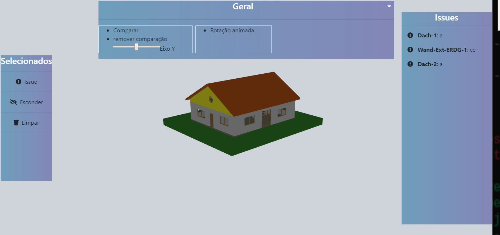

# construBIM
 
## BETA

para iniciar, navegue até o diretorio e de o comando ´python -m http.server 8080´ para abrir um pequeno servidor na porta 8080 para visualizar o sistema, ou utilize um servidor de sua escolha.

